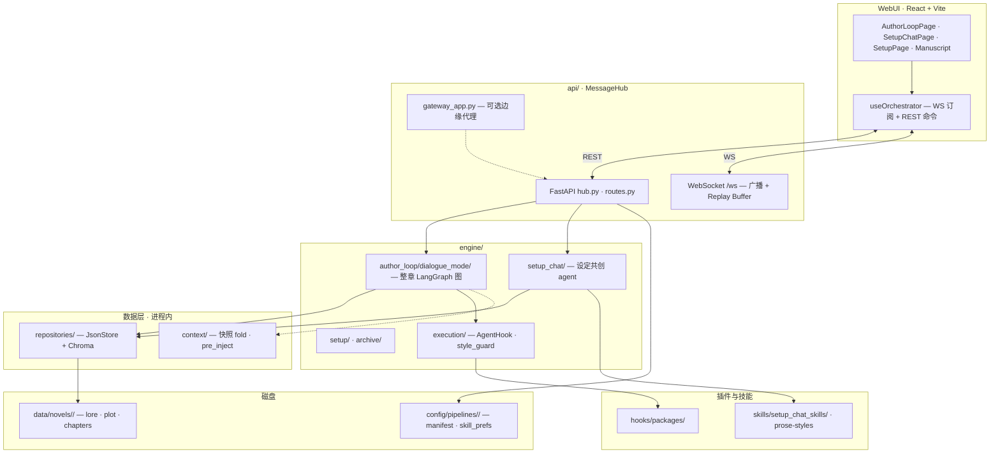
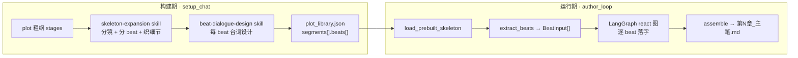
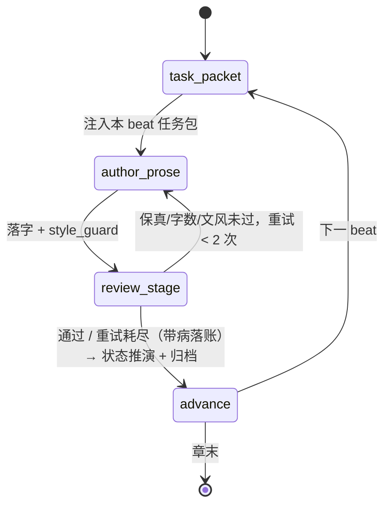

# Chronos: 项目架构与核心协议总纲

本项目采用 **WebUI (React + TS) + 单进程异步后端 + 对话驱动主笔循环（dialogue mode）** 的架构。章节生产路径为 `engine/author_loop/dialogue_mode/`：设定共创预建分镜与台词设计 → LangGraph 整章回合门控图逐 beat 落字 → 状态推演 → 检查点续写。

> **历史说明**：V8–V11 的 LangGraph DAG 段级流水线、`NodeGraph`、`StepMode`、classic 主笔（architect → 决策 → expansion skill → 落字 → 守卫 → 摘要）、四阶段 context hook（`brainstorm_/embed_/fill_/judge_context`）、独立 MCP 数据服务进程与 `api/protocol.py` 交互 codec 均已退役。下文描述**当前 live 架构**（V13 · dialogue mode）。

---

## 1. 架构总览与分层设计

### 1.1 后端分层

| 层 | 职责 |
|----|------|
| **`api/`** | `MessageHub`：FastAPI + WebSocket/REST、事件重放、后台任务（archive / setup / author_loop / setup_chat） |
| **`engine/author_loop/`** | **创作主路径**：预建骨架读取 → 整章 LangGraph 图（task_packet → author_prose → review_stage → advance，review_stage 审核门控 + 状态推演） |
| **`engine/setup_chat/`** | 设定共创 LangGraph agent：骨架扩写、分镜分 beat、台词设计、construction plan |
| **`engine/setup/`** | world / cast / plot 批量设定构建（legacy 批处理入口） |
| **`engine/archive/`** | 角色档案 timeline 构建 |
| **`engine/execution/`** | `AgentHook` IoC 契约 + 共用原语（`style_guard` / `prose_style` / `llm_json`） |
| **`engine/validator/`** | Agent 包结构校验、`agent.meta.json` 同步 |
| **`repositories/`** | **数据访问 SSOT**：`JsonStore` + 领域 repo（lore/plot/archive/world）+ Chroma RAG |
| **`context/`** | 低层上下文 helper：性别解析、角色快照 fold、timeline、dialogue 脚手架、`pre_inject` |
| **`domain/`** | 偏好统计、章节用量清理 |
| **`llm/`** | 流式调用、Prompt 分层、Token NDJSON 日志 |
| **`hooks/packages/`** | Agent 插件（prompt + hook + assets；dialogue 热路径外逐步迁入 `skills/`） |

### 1.2 引擎 ⇄ 插件（IoC）

调度层对具体 Agent **零认知**，经 `AgentPluginLoader` 发现 `hooks/packages/*/hook.py`。当前 live 扩展点（classic expansion skill 路径已退役）：

| 扩展点 | 用途 |
|--------|------|
| `display_name` / `description` / `agent_type` | skill 发现与 UI 展示 |
| `injects` | prompt `<!-- requires: … -->` 契约 lint |
| `build_options` / `render_selection_option` | **仅 classic 路径**；dialogue mode 写作期不调用 |
| `review` | 包校验用 |

策略与 prompt 正文下沉各 Agent 包或 `skills/setup_chat_skills/`；引擎提供原语与图调度。详见 `docs/AGENT_PACKAGE.md`。

### 1.3 系统总览图

### 1.4 章节生产端到端

用户通过 WebUI **Setup Chat** 完成骨架扩写与台词设计后，主笔循环读取预建 beats，**写作期不再弹出 skill 选项卡**（交互前移到构建期）。

### 1.5 演进里程碑（摘要）

| 版本 | 要点 |
|------|------|
| V8–V9 | 内存状态机、单进程 MessageHub |
| V10 | AgentHook IoC、资产自治、多档案 pipeline |
| V11–V12 | DAG 执行链退役；classic 主笔循环；manifest 降级为元数据 |
| **V13（当前）** | **dialogue mode**：setup_chat 预建 beats → LangGraph 整章图；repositories 取代 MCP/ContextRegistry；状态守卫 `guard.py` 退役 |

---

## 2. 主笔写作循环（dialogue mode）

### 2.1 LangGraph 回合门控图

整章维护**一条** `messages` 线程；引擎按 beat 队列门控，主笔每 beat 只追加「任务包 + 正文」两条消息。

| 节点 | 职责 |
|------|------|
| **task_packet** | 渲染 skeleton + dialogue design + 角色卡；重置单 beat 控制字段 |
| **author_prose** | 主笔写本 beat 候选正文（只生成，不定稿）；旁路 fire-and-forget **observer** 仅报警 |
| **review_stage** | 保真/字数/文风三项审核门（map-reduce，见 `stage_review.py`）；未过且重试 < 2 次回退 author_prose 重写并附审核反馈，重试耗尽则"带病落账"；通过/耗尽后调用 `_finalize_stage`：emit segment + `state_derive.derive_character_states` 推演角色动态态 + 归档跨章记忆 |
| **advance** | 广播进度、递增 `beat_idx`；旧拍在 LLM 视图中坍缩为骨架概要（`KEEP_FULL_BEATS=2`） |

> **2026-07-06**：逐角色并发 **状态守卫**（`dialogue_mode/guard.py`）已退役。**2026-08**：独立 `derive_states` 节点与 `update_states` 工具校验门也已合并进 `review_stage`（commit `650359a4`）——状态推演改为 review 通过/重试耗尽后调用 `state_derive.derive_character_states` 做结构化 JSON 抽取（非 tool-call），旧校验门不再存在。

模块真源：`react_graph.py` 模块 docstring、`chapter.py`、`turns.py`、`stage_review.py`、`state_derive.py`。

### 2.2 状态与检查点

- **图检查点**：`data/novels/<id>/chapters/_author_loop_graph.sqlite`（LangGraph SQLite checkpointer，thread `ch{N}`）
- **事件日志**：`chapters/<dir>/chapter_NNN_journal.ndjson`（断线重放；不含高频 `author_loop_token`）
- **章末落盘**：`POST /api/author-loop/save` → `第N章_主笔.md`
- **跨 beat 记忆**：整章 system prompt 一次注入文风；`_llm_view` 压缩早期 beat，checkpoint 保留完整历史

### 2.3 Pipeline 档案

`config/pipelines/<id>/manifest.json` + `author_loop_skill_prefs.json`：档案切换、agent-meta 同步、WebUI skill 编排。**不驱动**运行时拓扑；dialogue mode 热路径固定为 react 图。

---

## 3. 通信协议

### 3.1 MessageHub

- **WebSocket** `/ws`：服务端→客户端广播；新连接重放 Replay Buffer（跳过 `author_loop_token` 等高频 ephemeral 事件）。
- **REST**：启动/停止/保存/续跑等命令走 HTTP；无写作期双向 prompt 交互。

### 3.2 主笔事件（live · dialogue mode）

| 事件 | 方向 | 说明 |
|------|------|------|
| `author_loop_start` / `done` / `error` / `stopped` | 出 | 章级生命周期（`done` 含 `mode: dialogue`） |
| `author_loop_chapter_progress` | 出 | beat 级进度 `{done, total}` |
| `author_loop_segment` | 出 | 定稿 beat 正文（含 `agent`/`role`/`draft`） |
| `author_loop_token` | 出 | 流式增量 `{agent, delta}`（不重放） |
| `author_loop_state` | 出 | 推演态 `{index, characters[], entry?}` |
| `author_loop_summary` | 出 | 滚动摘要（journal 用） |
| `author_scene_image_started` | 出 | 某 stage 场景生图开始（侧车，不进 journal） |
| `author_scene_image_done` | 出 | `{chapter, index, filename?}` 或 `{chapter, index, error}` |

载荷形状见 `docs/protocol-contract.md`。

> **已退役**：`author_loop_prompt` / `author_loop_reply`（classic 写作期 skill 选项交互）。前端不再消费；journal 中可能保留历史行。

### 3.3 Token 日志

引擎 NDJSON 日志（`logs/engine_server/`）记录每步 LLM 调用的 input/cached/output；`scripts/token_report.py` 聚合分析。

---

## 4. 数据层

### 4.1 Repositories（取代 MCP + ContextRegistry）

启动时 `init_repositories()` 扫描 `data/novels/<active>/` 下 JSON；读写经 `get_lore_repo()` / `get_plot_repo()` / `get_archive_repo()` 等 accessor。可选 Chroma 索引用于台词语料与 research grounding。

`context/` 保留角色快照 fold、性别、timeline 等**纯函数 helper**，不经四阶段 hook 链。

### 4.2 Agent 治理

- 每包：`hook.py` + `{role}.md` + 可选 `assets/` + 自动生成的 `agent.meta.json`
- CI / pre-commit：`agent_package_check` — `requires ⊆ injects`、meta drift、未接入孤儿包

---

## 5. 设计决策（ADR 摘要）

| 决策 | 理由 |
|------|------|
| 单进程多任务 | 避免多进程端口碎片；asyncio 协程池足够 |
| dialogue mode 取代 classic + DAG | 交互前移到 setup_chat；写作期专注流式落字，降低并发 prompt 死锁面 |
| 预建 beats | 分镜/台词在构建期敲定，主笔只执行任务包，减少弱模型注意力分散 |
| repositories 内聚 | 消灭 MCP RPC 延迟与进程运维；数据与引擎同进程、路径 SSOT 在 `utils.paths` |
| 状态守卫退役 | 报警收益不足以覆盖逐 beat 多路 LLM 校验成本；保留 `update_states` 工具门 |
| manifest 降级为元数据 | 执行路径固定；manifest 保留 skill 接线与 meta 同步 |

---

*Chronos Architecture | dialogue mode · V13 | 2026-07-06*
